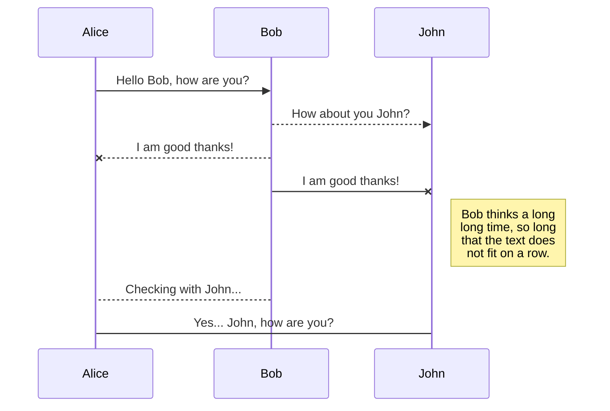

# Instruction Set Design

## Table of Contents
This document is meant to record the following information:
* The __drawback__ of existing instruction set;
* The __principle__ of designing the new instruction set;
* The proposed new __instruction set__;
* The proposed new __instruction encoding__;
* __Differences__ between new and old IS and reasons to change;
* Future __improvements__;
* Appendix: A __detailed analysis__ for each instruction, and how other operations can be generated by the superposition of others.

## Drawback of existing instruction set
Below is a full reference of existing (old) instruction set:
| Opcode              | Explanation               | Semantics           | Type  |
| :------------------ | :------------------------ | :---------------    |:----- |
| __ADD__             |   add two operands        | _R1 <- R2 + R3/imm_ |  R/I  |
| __UMUL__            |   multiple two operands   | _R1 <- R2 * R3/imm_ |  R/I  |
| __UDIV__            |   divide two operands     | _R1 <- R2 / R3/imm_ |  R/I  |
| __UMOL__            |   op1 % op2               | _R1 <- R2 % R3/imm_ |  R/I  |
| __AND__             |   bitwise And of A & B    | _R1 <- R2 & R3/imm_ |  R/I  |
| __ORR__             |   bitwise Or of A & B     | _R1 <- R2 \| R3/imm_|  R/I  |
| __XOR__             |   bitwise Xor of A & B    | _R1 <- R2 ^ R3/imm_ |  R/I  |
| __SHL__             |   logical shift left      | _R1 <- R2 << R3/imm_|  R/I  |
| __SHR__             |   logical shift right     | _R1 <- R2 >> R3/imm_|  R/I  |
| __RTL__             |   logical rotate left     | _R1 <- R2 <~ R3/imm_|  R/I  |
| __RTR__             |   logical rotate right    | _R1 <- R2 ~> R3/imm_|  R/I  |
| __NOT__             |   comp all the bits       | _R1 <- ~R2_         |  U    |
| __LDR__             |   load reg from mem       | _R1 <- [R2]_        |  U    |
| __STR__             |   store reg in mem        | _[R1] <- R2_        |  U    |
| __PUSH__            |   push reg onto stack     | _[SP - 4] <- R1_    |  S    |
| __POP__             |   pop top ele into reg    | _R1 <- [SP] + 4_    |  S    |
| __JMP__             |   unconditional jump      | _N/A_               |  J    |
| __JZ__              |   jump if Z flag is set   | _N/A_               |  J    |
| __JC__              |   jump if C flag is set   | _N/A_               |  J    |
| __JV__              |   jump if V flag is set   | _N/A_               |  J    |
| __JZN__             |   jump if Z or N is set   | _N/A_               |  J    |
| __JN__              |   jump if N flag is set   | _N/A_               |  J    |
| __SYSCALL__         |   invokes system calls    | _N/A_               |  J    |

There are several drawbacks can be concluded from above chart:

